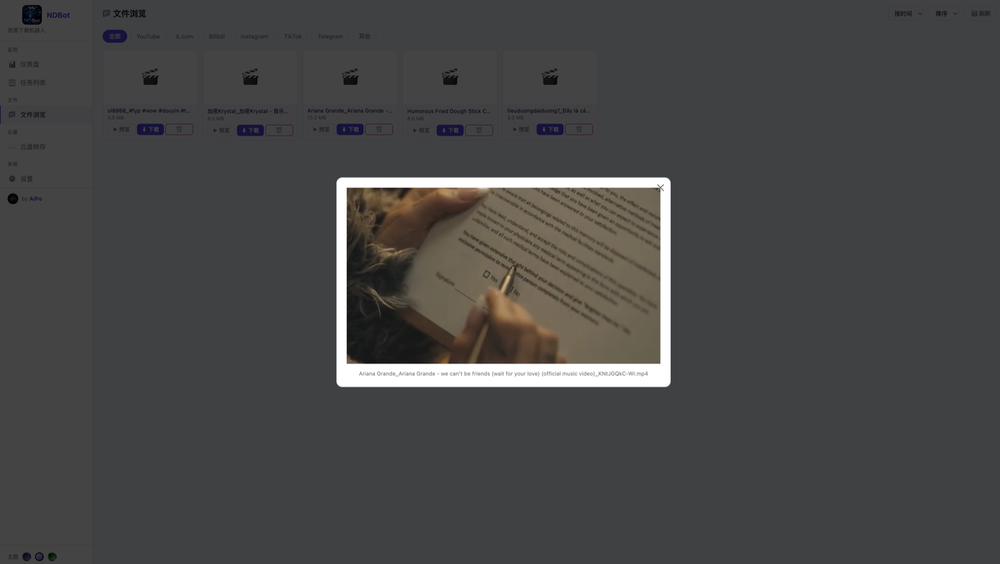
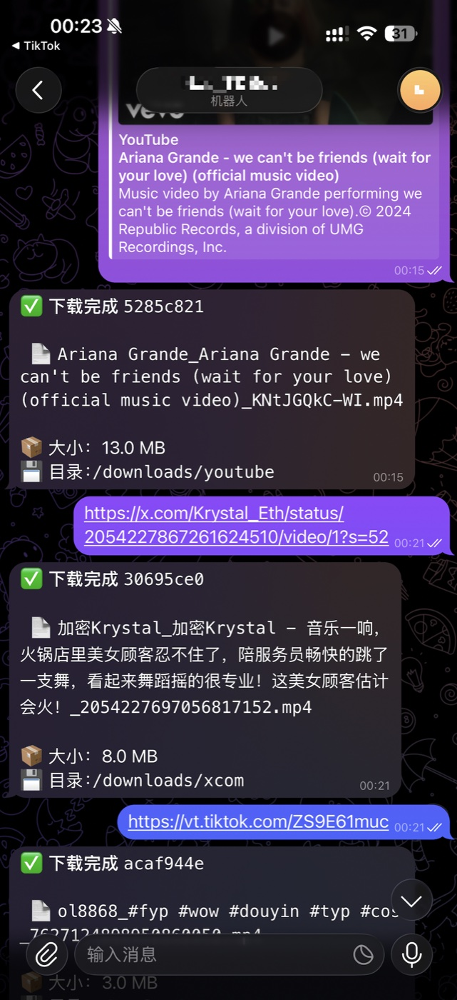

# 📥 NDBot v1.01.0512   by AiPo
## Docker 自部署统一资源下载机器人 — YouTube / X.com / Bilibili / Instagram / TikTok / Telegram 媒体 + 云盘同步

[](https://www.gnu.org/licenses/agpl-3.0)
[](https://github.com/aipo-lenshow/NDBot/releases)
[](https://github.com/aipo-lenshow/NDBot/actions/workflows/scan.yml)

> [English README](./README_EN.md)

## 截图

**Web 控制台 — 文件浏览 + 在线预览**



**Telegram Bot — 发链接, 自动下载 + 归类**

<p></p>

## ⭐ 亮点 Highlights

<table>
<tr>
<td valign="top" width="33%">

**📥 通用下载器**

主流 6 平台 (YouTube / X / Bilibili / Instagram / TikTok / Telegram 媒体) + yt-dlp 支持的 1000+ 网站. 画质可选 (最佳 / 1080p / 720p / 480p), 字幕 / 封面 / MP3 / M4A 一并拿.

</td>
<td valign="top" width="33%">

**🤖 发链接, 取文件**

转任意 URL 给你的 Telegram Bot, 文件 30 秒推回来. 内联按钮选格式 / 画质. 多用户走白名单 (`ALLOWED_USERS`).

</td>
<td valign="top" width="33%">

**🖥️ Web 控制台**

`:5000` 文件浏览 + 在线预览 (视频 / 音频) + 任务队列监控 + 磁盘看板. 可选密码保护. 暗色为主题.

</td>
</tr>
<tr>
<td valign="top" width="33%">

**☁️ 自动云盘同步**

rclone 原生接 OneDrive / Google Drive / S3 / R2 / NAS (Samba / SFTP). 百度 / 阿里 / 夸克通过 AList 转 WebDAV. 下完自动推, 或 `/sync` 手动.

</td>
<td valign="top" width="33%">

**🔓 Cookies 解锁会员**

丢一份 `youtube.txt` / `xcom.txt` / `bilibili.txt` 到 `./cookies/`, 即可下载 YouTube 会员 / X 私密 / B 站大会员. 热加载, 不用重启.

</td>
<td valign="top" width="33%">

**⚡ 一行装机**

`bash install.sh` 交互向导一次过完代理 + Telegram + 云盘 + Cookies 配置. 或 `python3 install_tui.py` 图形版. 4 个 Docker 服务, 默认 amd64 + arm64.

</td>
</tr>
</table>

<details>
<summary><strong>📋 完整功能 (持续更新)</strong></summary>

**支持平台**

| 平台 | 支持内容 |
|------|----------|
| 🎬 YouTube | 视频 (最佳 / 1080p / 720p / 480p) / MP3 / M4A / 字幕 / 封面 |
| 🐦 X.com (Twitter) | 视频 / 图片 / 全部媒体 |
| 📺 Bilibili | 视频 / 音频 |
| 📸 Instagram | 视频 / 图片 |
| 🎵 TikTok | 视频 / 音频 |
| 🌐 其他 | 所有 yt-dlp 支持的 1000+ 网站 |
| 📨 Telegram 媒体 | 转发消息给机器人即可保存 |

**架构 / 部署**

- 4 个服务: `bot` (Pyrogram + PTB) / `worker` (yt-dlp + rclone) / `web` (Flask UI) / `redis` (任务队列)
- 双安装器: Shell 向导 (`install.sh`, 零依赖) + Python TUI (`install_tui.py`, 自动装 questionary + rich)
- 并发下载数可配 (`MAX_CONCURRENT_DOWNLOADS`)
- 单文件大小限制可配 (`MAX_FILE_SIZE_MB`)
- 国内代理友好: 一次配置, 所有容器内 HTTP 请求自动走代理
- CIFS / NAS 共享挂载支持 (`:shared` propagation)
- `/api/health` 端点 (返回 version + redis 状态)

**云盘同步细节**

- 原生 rclone 后端: onedrive / drive / s3 / smb / sftp / webdav / ftp
- AList 中转: 百度网盘 / 阿里云盘 / 夸克 / 迅雷 / 115 / PikPak / 天翼 / 移动彩云 / 189 等
- 触发模式: `auto` (下完即推) / `manual` (`/sync` 命令)
- 上传后可选: 保留本地 / 删本地

**安全 / 运维**

- 三件套防线: env vars + pre-commit hook + GitHub CI 扫描敏感字符串
- 全局 docker compose 命令: logs / restart / 更新 yt-dlp / 清理任务
- 卸载干净: `docker compose down --rmi all --volumes` + `rm -rf <install dir>`

</details>

## 快速安装

### 方式一：Shell 交互向导（推荐，零依赖）

```bash
bash install.sh
```

### 方式二：Python TUI 向导（界面化，需要安装缺失）

```bash
python3 install_tui.py
```

两种方式均会引导你完成所有配置，包括代理、云盘同步、Cookies 等。

---

## 手动部署

### 第一步：配置 .env

```bash
cp .env .env.bak   # 备份（如已有配置）
nano .env
```

填写必填项：

```
BOT_TOKEN=从 @BotFather 获取
TG_API_ID=从 my.telegram.org/apps 获取
TG_API_HASH=从 my.telegram.org/apps 获取
PROXY_HOST=你的代理IP（国内服务器必填）
PROXY_PORT=7890
ALLOWED_USERS=你的Telegram用户ID
DOWNLOAD_PATH=./downloads
```

### 第二步：创建目录并启动

```bash
mkdir -p downloads sessions cookies rclone
docker compose up -d --build
docker compose logs -f
```

---

## Cookies 配置（下载会员内容）

适用场景：YouTube 会员视频、X.com 私密内容、B站大会员等。

1. 浏览器安装扩展 [Get cookies.txt LOCALLY](https://chromewebstore.google.com/detail/cclelndahbckbenkjhflpdbgdldlbecc)
2. 登录对应网站后导出 Cookie 为 .txt 文件
3. 上传到 `./cookies/` 目录，按平台命名：

```
cookies/
├── youtube.txt     YouTube
├── xcom.txt        X.com / Twitter
├── bilibili.txt    B站
└── cookies.txt     通用兜底
```

无需重启，下次下载时自动生效。

---

## 云盘同步（rclone）

### 支持情况

| 云盘 | 支持方式 | 说明 |
|------|---------|------|
| OneDrive | ✅ 原生 | rclone 直接支持，类型选 `onedrive` |
| Google Drive | ✅ 原生 | rclone 直接支持，类型选 `drive` |
| S3/R2/COS/OSS | ✅ 原生 | rclone 直接支持，类型选 `s3` |
| NAS (Samba) | ✅ 原生 | rclone 直接支持，类型选 `smb` |
| NAS (SFTP) | ✅ 原生 | rclone 直接支持，类型选 `sftp` |
| 百度网盘 | 🔄 通过 AList | rclone 无原生后端，需 AList 转 WebDAV |
| 阿里云盘 | 🔄 通过 AList | rclone 无原生后端，需 AList 转 WebDAV |
| 夸克网盘 | 🔄 通过 AList | rclone 无原生后端，需 AList 转 WebDAV |
| 迅雷/115/PikPak 等 | 🔄 通过 AList | 同上 |

---

### 方案一：OneDrive / Google Drive / S3 直接配置

```bash
# 1. 安装 rclone
curl https://rclone.org/install.sh | sudo bash

# 2. 交互配置（以 OneDrive 为例）
rclone config
# 选 n → 名称随意输入（如 onedrive）→ 类型选 onedrive → OAuth 授权

# 3. 复制到项目
cp ~/.config/rclone/rclone.conf ./rclone/rclone.conf

# 4. 修改 .env
RCLONE_ENABLE=true
RCLONE_REMOTE=onedrive    # 填你在 rclone config 里起的名字
RCLONE_DEST=NDBot

# 5. 重启
docker compose up -d
```

---

### 方案二：百度网盘 / 阿里云盘 / 夸克（通过 AList）

> 这三个云盘 rclone **没有原生支持**，必须先通过 [AList](https://alist.nn.ci) 作为中间层。
> AList 支持几十种国内云盘，部署后提供 WebDAV 接口供 rclone 连接。

**第一步：部署 AList（Docker）**

```bash
docker run -d   --name alist   --restart unless-stopped   -p 5244:5244   -v /你的数据目录/alist:/opt/alist/data   xhofe/alist:latest

# 设置管理员密码
docker exec -it alist ./alist admin set 你的密码
```

**第二步：添加云盘账号**

浏览器访问 `http://你的服务器IP:5244`，用 admin 账号登录：

- 点击左上角菜单 → **管理** → **存储** → **添加**
- 驱动选择：**百度网盘** / **阿里云盘Open** / **夸克网盘**
- 挂载路径填 `/baidu`（或 `/aliyun`、`/quark`，随意）
- 按提示扫码或填写 Token 完成授权
- 点击保存，首页应能看到对应云盘文件

**第三步：配置 rclone 连接 AList**

```bash
# 安装 rclone（如未安装）
curl https://rclone.org/install.sh | sudo bash

# 生成 AList 密码的 rclone 加密格式（必须用这个格式）
rclone obscure 你的AList密码
# 记录输出的加密字符串

# 交互配置
rclone config
# 选 n（新建）
# name> 输入：alist
# Storage> 输入：webdav
# url> 输入：http://你的服务器IP:5244/dav
# vendor> 输入：other
# user> 输入：admin（或你的AList用户名）
# pass> 输入：上面 obscure 输出的加密字符串（不是明文密码！）
# 其余直接回车
# 最后输入 y 保存，输入 q 退出

# 测试（能看到云盘目录即成功）
rclone lsd alist:

# 复制配置到项目
cp ~/.config/rclone/rclone.conf ./rclone/rclone.conf
```

**第四步：启用 NDBot 同步**

```bash
# 修改 .env
RCLONE_ENABLE=true
RCLONE_REMOTE=alist
RCLONE_DEST=NDBot
RCLONE_MODE=auto      # 下载完自动上传，或改为 manual 手动触发

# 重启
docker compose up -d
```

详细配置参考 `./rclone/rclone.conf.example`。

---

## 常用运维命令

```bash
# 查看日志
docker compose logs -f
docker compose logs -f bot      # 只看 Bot
docker compose logs -f worker   # 只看下载进度

# 重启
docker compose restart

# 更新 yt-dlp（修复平台下载问题）
docker compose exec worker pip install -U yt-dlp && docker compose restart worker

# 查看下载文件大小
du -sh downloads/*/

# 测试 rclone 连接
docker compose exec worker rclone --config /config/rclone/rclone.conf lsd 你的remote名:
```

---

## 卸载

```bash
cd 你的安装目录

# 停止并删除所有容器、镜像、网络
docker compose down --rmi all --volumes

# 删除项目目录（含配置文件）
cd ..
rm -rf 你的安装目录
```

> ⚠️ **卸载前请备份 downloads 目录中的已下载文件！**

---

## 常见问题

**Q: Bot Token 报 SESSION_REVOKED**  
A: 在 @BotFather 撤销旧 Token 后，必须同时删除 session 文件：
```bash
rm -f sessions/*.session sessions/*.session.lock
docker compose restart bot worker
```

**Q: YouTube 报"需要登录"**  
A: 配置 `cookies/youtube.txt`

**Q: Telegram 私有频道无法下载**  
A: 无法通过链接直接下载，请将消息**转发**给机器人

**Q: 修改了 DOWNLOAD_PATH 文件还在老位置**  
A: 需要完全重启才能重新挂载 volume：
```bash
docker compose down && docker compose up -d
```

---

## License

NDBot is licensed under the GNU Affero General Public License v3.0 (AGPL-3.0).
See [LICENSE](./LICENSE) for the full text.

简言之：本项目自由使用、修改、再分发，但任何基于 NDBot 修改的版本（包括通过网络对外提供服务的部署）必须以同样的 AGPL-3.0 协议公开源码。

